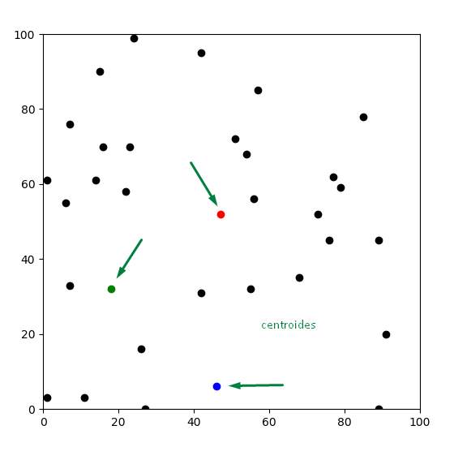
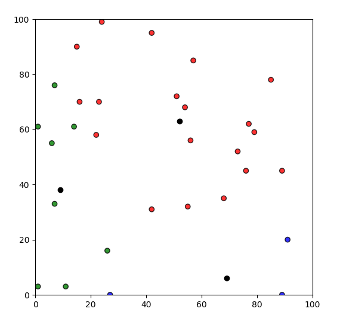
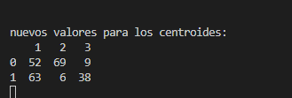
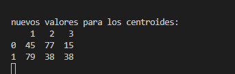
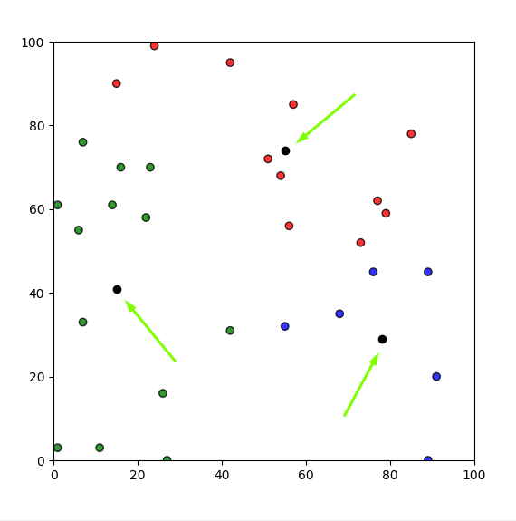
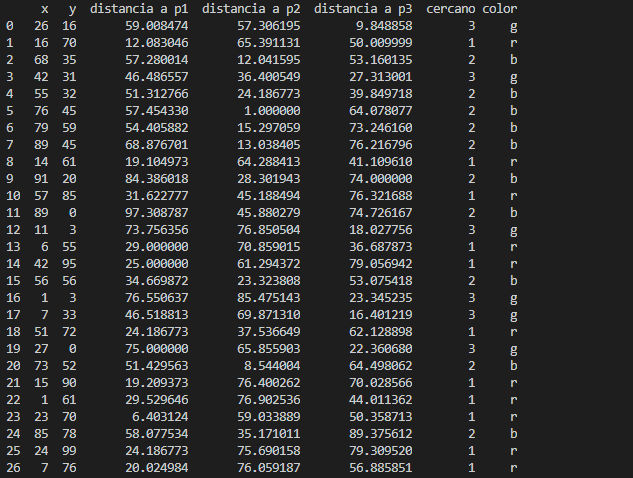
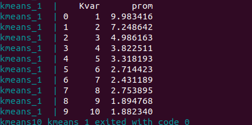

# Machine Learning Challenge

Kmeans es un algoritmo no supervisado de machine learning, el cual toma los datos que se brindan para ordenarlos o separarlos
en conjuntos de datos similares. De esta manera se puede crear diferetes MLs capaces de reconocer objetos, datos,etc. 
por sus caracteristicas. 
A diferencia del machine learning que trabaja "prediciendo" los datos con el descenso de gradiente,
atraves de un conjunto de datos utilizado para testing, validation y training, este algoritmo solo reconoce que un conjunto
de datos son similares y que otros no.

 
este documento expecifica como es el uso del script creado.
1) ejecutar la terminal
2) posicionarse en la carpeta kmeans0.2
3) ejecutar el comando docker-compose build
4) ejecutar el comando docker-compose up (correra el script src/main.py)
5) para mejor control de las iteraciones, puede escribir la siguiente linea en el terminal:

	- ***docker-compose run kmeans sh -c "python main.py iter"***: para ejecutar un numero de iteraciones determinadas por usted,
	en este caso seran 100 iteraciones, pero puede cambiarlo simplemente modificando 100 por algun numero a su gusto.

	- ***docker-compose run kmeans sh -c "python main.py n_samples"***: para ingresar por pantalla la cantidad de puntos en el eje
	de coordenadas que se analizara

	- ***docker-compose run kmeans sh -c "python main.py iris"***: por default, el algoritmo trabaja con bases de datos con circulos pero
	esto se puede cambiar agregando iris a la entrada, de esta manera tendremos datos de flores iris de dos dimensiones. 

### DETALLES:
al ejecutar el script podra observar en su terminal diferentes impresiones por pantalla, la primera que vera seran
	de los centroides, los cuales cambian su valor hasta encontrar alguno que se repita consecutivamente.
  

(estas marcados como filas 0 y 1; estas refieren a que 0 son los X y 1 son los Y de cada punto. mientras que las
	columnas 1,2,3 son los centroides que poseemos)
  
  

lo segundo que observara es un dataframe creado con pandas, el cual le mostrara el resultado final de todos los 
	puntos, tanto las distancias con cada centroides, como el centroide asignado y su respectivo color
	(r = red, b = blue, g = green)
  

al final de programa obtendra una salida de los 10 k con los que se probo el algoritmo, junto al promedio de las distancias entre los puntos con su centroide mas cercano.

para finalizar, si decea observar observar como se acomodan nuestros centroides con cada ciclo, ejecute el script
	individualmente con el comando 'python src/main.py' ('python3 src/main.py' si utiliza linux) debido a un error que
	no pude solucionar el cual no muestra los plt.show() cuando se ejecuta en docker.
  
  
